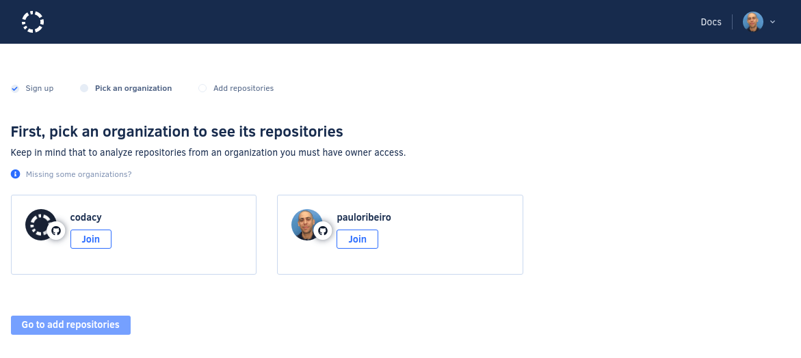
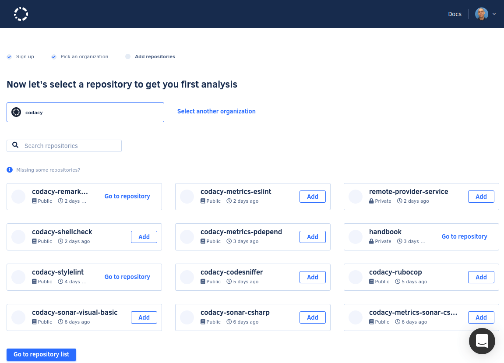

# Getting started with Codacy

Codacy automatically identifies issues through static code review analysis and notifies you on security issues, code coverage, code duplication, and code complexity in every commit and pull request.

To get started, head to [codacy.com](https://www.codacy.com/) and click **Get started**.

## 1. Sign up {: id="sign-up"}

Signing up with a Git provider such as GitHub, GitLab, or Bitbucket links your Codacy user with your Git provider user, making it easier to add repositories to Codacy and invite your teammates.

Codacy will ask you to have access to your Git provider during the authorization flow. [Check the permissions that Codacy requires and why](which-permissions-does-codacy-need-from-my-account.md).

## 2. Account details {: id="account-details"}

You'll be asked to fill in a few details about your company so we know a bit more about your use case.

## 3. Choose an organization {: id="choose-organization"}

Now, you'll need to join one or more organizations that contain your repositories. The organization with the same name as your Git provider username contains your personal repositories. The selected organizations will then be synced with Codacy so that managing your team permissions is easy. Read more about [what synced organizations do](../organizations/what-are-synced-organizations.md). 

!!! tip
    If you can't see the organization you are looking for, [follow these troubleshooting instructions](../faq/general/why-cant-i-see-my-organization.md).

To start adding your repositories, select one of the organizations and click **Go to add repositories**.

## 4. Add repositories {: id="add-repositories"}

And as a final step, add the repositories that you wish to analyze. Codacy will start the first analysis and set up everything required to ensure your next commits on those repositories are analyzed.

## You're all set! 🎉 {: id="all-set"}

Read our guide on [what to do with a newly added repository](i-added-a-repository-now-what.md) to explore static analysis issues and continue configuring your repository.
