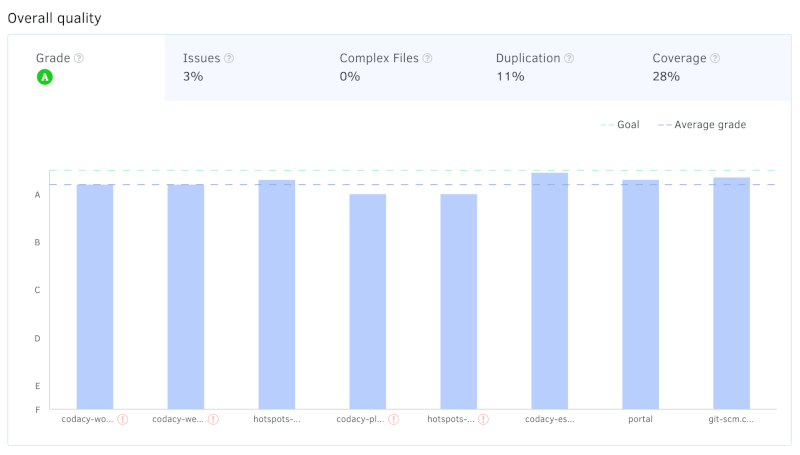
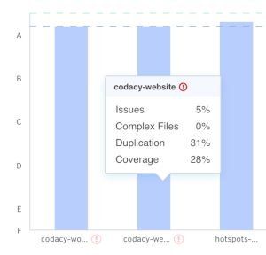
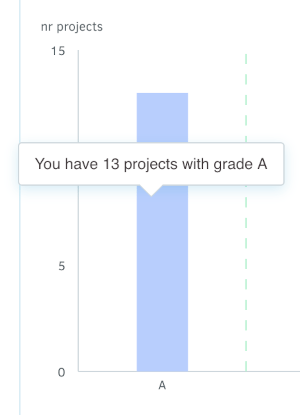
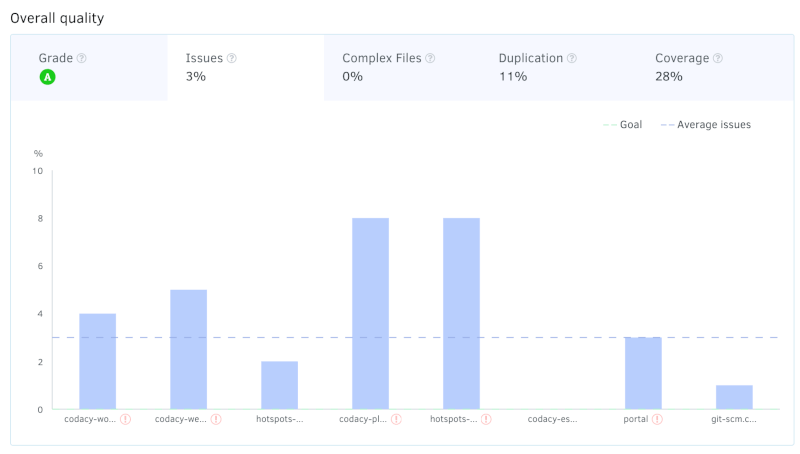
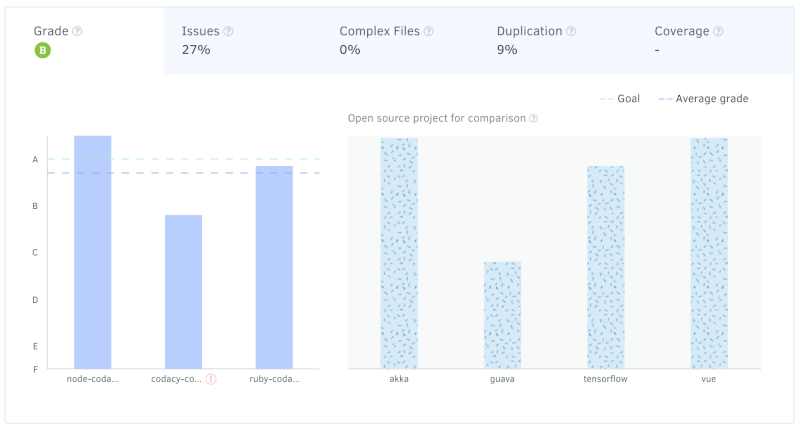
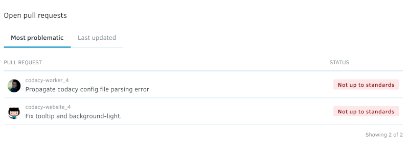
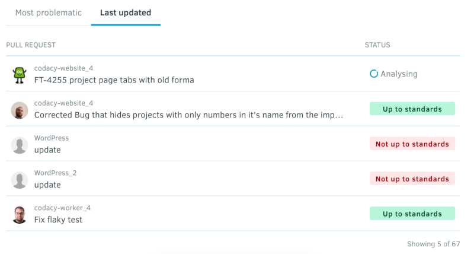

# Organization Dashboard overview

Your **Organization Dashboard** offers an overview of repositories that belong to the same team. Here you can compare their statuses and check for items that require your attention.

You can access your Organization Dashboard by selecting a specific organization in the top navigation bar or by selecting an Organization in your Account Menu.

On the Organization Dashboard, you have three areas that will help you monitor your team's repositories:

-   Overall quality chart (1)
-   Open pull requests (2)
-   Last updated repositories (3).

The following sections provide a detailed overview of each dashboard area.

## Overall quality chart

The Overall Quality Chart displays your repositories and compares them against the average grade, your defined goal, and across each specific criteria: Issues, Complex Files, Duplication, and Coverage.

-   In the upper left is the average grade (A, in this example).
-   The graph displays how different repositories match up to your goals and the average grade.
-   You can see how each repository is performing by hovering over the bar. If something is not up to standards, you will see it flagged.
-   You can also go directly to each repository by clicking on the name of the repository at the bottom of each column.

If you have over 8 repositories, you will see your repositories grouped by Grade or by the interval of Issues (number of repositories you have with Issues between 0%-20%, 20%-40%, 40%-60%, 60%-80%, 80%-100%).

Hover over each group of repositories to see a summary.

### Other criteria

-   For each specific criteria (Issues, Complex Files, Duplication, and Coverage), you can click on its tab to compare repositories.
-   This comparison will display your repositories' current statuses against the average and against your goal for this criteria.

### What if you don't have Coverage set up?

The graph will notify you when you click on the Coverage tab if you don't have Coverage set up for any of your repositories.

### What if I don't have enough repositories for comparison?

If you don't have enough repositories for comparison, don't worry - we have included some Open Source repositories for comparison so you can see how you match up.

## Open pull requests

Under this area you can see two tabs:

-   **Most problematic** pull requests
-   **Last updated** pull requests

These represent a short list of the open pull requests on the repositories of the selected team(s).

### Most problematic

Here you can see a short list of the most problematic open pull requests in all repositories of the selected team(s). These pull requests are defined as those not up to your defined standards that have the most potential to negatively affect your code quality.

You can click directly on each pull request to see more details.

### Last updated

This tab displays a short list of all open pull requests sorted by the date of update with a status. Pull requests can be:

-   Not up to standards
-   Up to standards
-   Analysis failed (in case something went wrong during the analysis)
-   Analyzing (an intermediate status while the pull request is under analysis)

## Last updated repositories

This area displays a maximum of 6 repositories by date of last update. Each repository card will display the date of the last update, the current grade, and the status for each criteria.

You can also See all repositories or Add a repository here.

