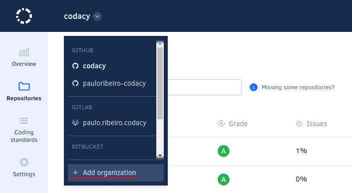

# What are synced organizations

Synced organizations let you automatically import your Git provider organizations, repositories (including your personal repositories that do not belong to a Git provider organization), and team members into Codacy with a few clicks.

Changes to the organizations, repositories, and team members are synchronized with Codacy in real time, avoiding the manual management of repositories and teams.

## Adding an organization

To add a new organization to Codacy, select **Add organization** on the navigation menu.

This opens the list of organizations on your Git providers. The organizations with the same name as your Git provider username contain your personal repositories.

-   To add a new organization to Codacy, click the button **Add** for that organization.
-   To add organizations from a Git provider that is not yet listed on this page, click **Add provider** and give the [necessary permissions](../getting-started/which-permissions-does-codacy-need-from-my-account.md) for Codacy to sync with the new Git provider and display your organizations.

!!! tip
    If you can't see the organization you are looking for, [find out what could be the possible reasons](why-cant-i-see-my-organization.md).

## Managing people in an organization

To see and manage who joined your organization on Codacy open your organization **Settings** and open **People**.

Members can add themselves to your Codacy organization when they log into Codacy using their Git provider credentials. In the **Plan and Billing** page there are different ways to control who can join your organization:

-   **Allow new people to join:** team members with access on the Git provider will be able to join the Codacy organization automatically and your billing will be updated accordingly.
-   **New people need to request access to join:** team members must request access to be able to join the Codacy organization. You can override this setting for organization owners.

The organizations that contain your personal repositories can only have the owner of the repositories as their single member.

!!! important
    **If you are using Bitbucket Cloud** the organization that contains your personal repositories can have other members, as defined by the [access control on Bitbucket](https://support.atlassian.com/bitbucket-cloud/docs/control-access-to-your-private-content/).

Members can remove themselves from organizations, while owners can remove themselves as well as other users, even other owners. Organizations must have at least one owner.

## Updates on the Git provider

In case you change your organization or repository on the Git provider, some changes will be reflected on Codacy. The following cases are supported:

| Provider | Rename repository | Change repository visibility | Delete repository | Rename organization or group | Remove member from organization or group | Delete organization or group |
|---|---|---|---|---|---|---|
| GitHub Cloud | Yes | Yes | Yes | Yes | Yes | Yes |
| GitHub Enterprise | Yes | Yes | Yes | Yes | Yes | Yes |
| GitLab Cloud | No | No | No | No | No | No |
| GitLab Enterprise |  Yes | Yes | Yes | Yes | Yes | Yes |
| Bitbucket Cloud | Yes | Yes | No | No | No | No |
| Bitbucket Server | Yes | Yes | No | No | No | No |

Check out the [roles and permission mapping from the Git providers](roles-and-permissions-for-synced-organizations.md).

## Deleting an organization

Delete an organization to remove that organization and all its repositories from Codacy.

To delete an organization, open the **Profile** page and click the button **Delete organization**.

!!! important
    **If you are using Codacy Cloud** we will ask for your feedback on why you are deleting your organization.

