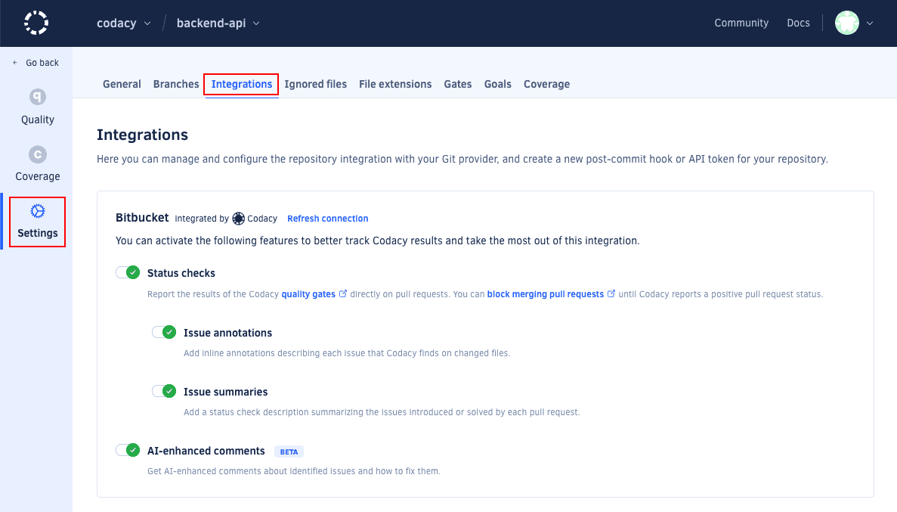
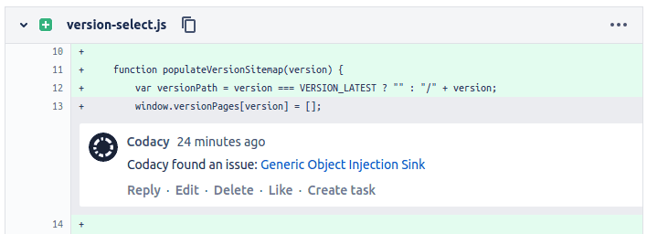
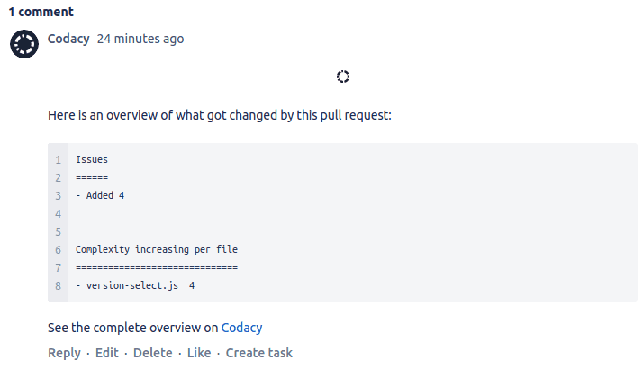

# Bitbucket integration

<!-- TODO Improve intro -->
When the integration is enabled, Codacy displays more options when browsing the existing issues on the repository:

The Bitbucket integration for comments on pull requests, issue creation, and more.

## Enabling the Bitbucket integration

To enable the Bitbucket integration, open your project **Settings**, tab **Integrations**. When you add a new repository, the integration is already enabled by default.

If you remove the integration, you can enable it again as follows:

1.  Click the button **Add integration** and select **Bitbucket** on the list.
1.  Follow the instructions to install the integration.
1.  Click the button **Enable**.

<!-- TODO Check this for every Git provider

After installing the integration for a repository, it has to be enabled by a user with repository access on Bitbucket. For private repositories, this user will by default become the Bitbucket user that Codacy will use to comment and create issues on Bitbucket. For public repositories, comments made by Codacy will appear as coming from codacy-bot.
-->

## Configuring the Bitbucket integration

To configure the Bitbucket integration, open your project **Settings**, tab **Integrations**.

Depending on the options that you enable, Codacy will automatically update pull requests on Bitbucket with extra information when accepting pull requests:

-   **Pull Request Status** adds a report to your pull requests showing whether your pull requests and coverage are up to standards or not as configured on the [quality settings](../../repositories/quality-settings.md) of your repository. To see the coverage status, ensure that you enable the option **Coverage** in the quality settings. 

    

    !!! important
        Codacy can only add the report if the user that added the integration has at least write permissions for that repository.

-   **Pull Request Comment** adds comments on the lines of the pull request where Codacy finds new issues. Click on the links to open Codacy and see more details about the issues and how to fix them.

    

-   **Pull Request Summary** shows an overall view of the changes in the pull request, including new issues and metrics such as complexity and duplication.

    
