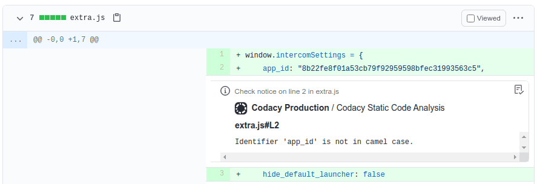

# GitHub integration

The GitHub integration incorporates Codacy on your existing Git provider workflows.

When the integration is enabled, you can create pull request comments and GitHub issues directly from Codacy when browsing the existing issues on the repository:

Depending on the configuration of the GitHub integration, Codacy can also report and notify you about issues directly on your pull requests.

## Enabling the GitHub integration {: id="enabling"}

To enable the GitHub integration, open your project **Settings**, tab **Integrations**. When you add a new repository, the integration is already enabled by default.

If you remove the integration, you can enable it again as follows:

1.  Click the button **Add integration** and select **GitHub** on the list.
1.  Click the button **Enable** and follow the instructions.

    !!! important
        The user that enables the integration must have administrator access to the repository.

## Configuring the GitHub integration

To configure the GitHub integration, open your project **Settings**, tab **Integrations**.

Depending on the options that you enable, Codacy will automatically update pull requests on GitHub with extra information when accepting pull requests:

-   **Status checks** adds a report to your pull requests showing whether your pull requests and coverage are up to standards or not as configured on the [quality settings](../../repositories/quality-settings.md) of your repository. To see the coverage status check, ensure that you enable the option **Coverage** in the quality settings.

    !!! tip
        After enabling this option, you can [set Codacy as a required check](../../faq/repositories/how-do-i-set-codacy-as-a-required-check-to-merge-prs.md#github) before merging your pull requests.

    

-   **Annotations** adds annotations on the lines of the pull request where Codacy finds new issues. To enable this option, you must enable **Status checks** first.

    

-   **Summary** shows an overall view of the changes in the pull request, including new issues and metrics such as complexity and duplication. To enable this option, you must enable **Status checks** first.

    

You can find all the information reported by Codacy on the tab **Checks** of your pull requests:

