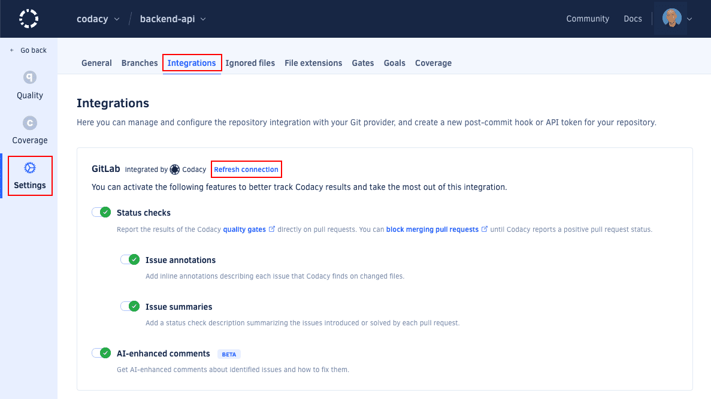

# Using a dedicated service account to integrate with your Git provider

**TESTING INFORMATION ARCHITECTURE**

!!! info "This page applies only to GitLab and Bitbucket"

Using a dedicated service account to integrate Codacy with your repositories prevents disruption of service if the user who originally enabled the integration loses access to the repositories.

To integrate Codacy with GitLab or Bitbucket using a dedicated service account, do the following:

1.  Create a service account on your Git provider exclusively dedicated to integrating Codacy with your repositories.

    !!! note
        The service account must:

        -   [Have administrator permissions](../../organizations/roles-and-permissions-for-organizations.md) on the repositories to integrate with Codacy
        -   Not be shared by other systems to ensure that Codacy doesn't hit the API rate limits of the Git provider when using this account

    !!! tip
        Using a dedicated service account also has the advantage of any pull request comments made by Codacy appearing as authored by the service account instead of by a regular organization member. You can name this account "Codacy" and use [this Codacy logo](https://avatars.githubusercontent.com/u/1834093) as the account picture so that your pull request comments look like the following example:

        

1.  Log out of both your Git provider and of Codacy.

1.  Log in to Codacy using the new service account.

1.  Open your repository **Settings**, tab **Integrations**, and click the link **Refresh connection** to refresh the existing Git provider integration:

    

1.  Make sure the Git provider integration is configured as needed:

    -   [Configuring the GitLab integration](gitlab-integration.md#configuring)

    -   [Configuring the Bitbucket integration](bitbucket-integration.md#configuring)
