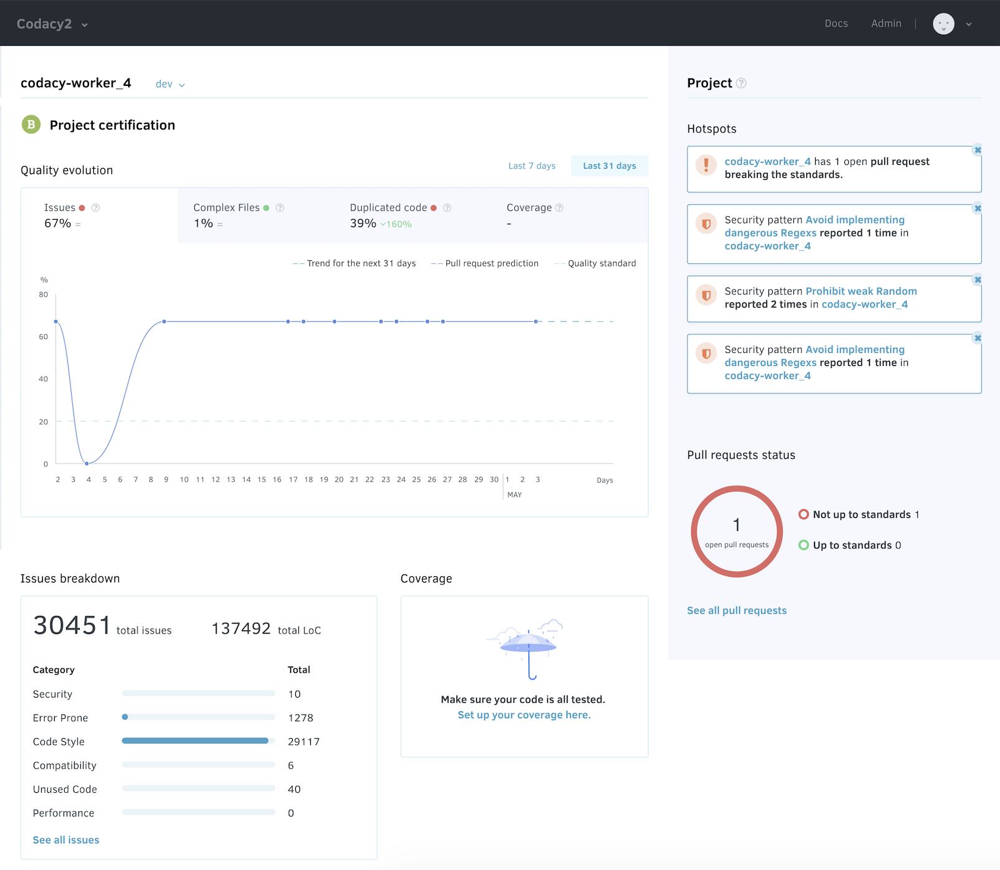
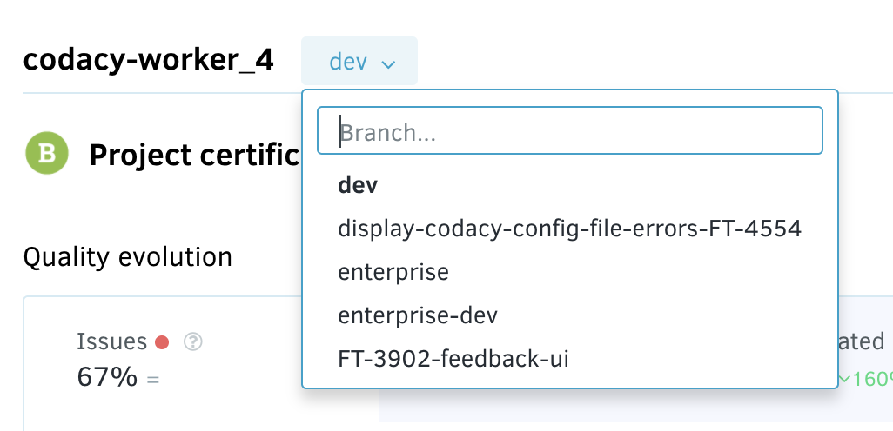
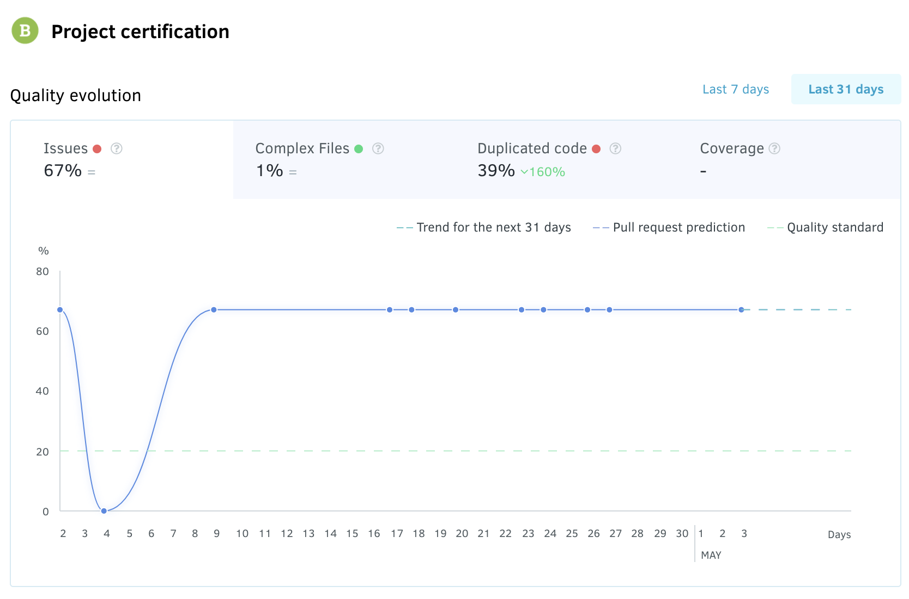
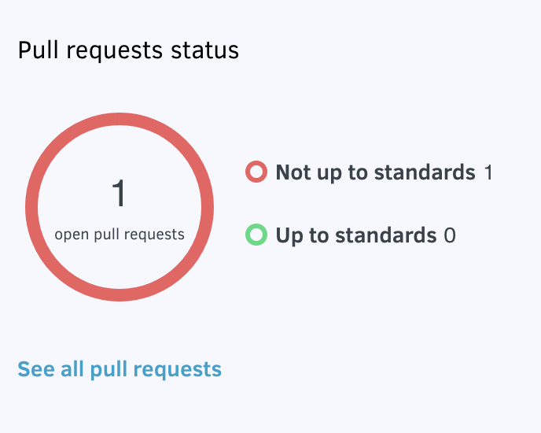

# Repository Dashboard overview

Your **Repository Dashboard** offers an overview of the repository and attention points we select for you on relevant items requiring your intervention.

You can access the Repository Dashboard by selecting a specific repository on the [Organization Dashboard](../organizations/organization-dashboard-overview.md), or by opening a repository on any other page of the platform.

On the Repository Dashboard you can find two main sections: the repository view of a specific branch (in white) and the main branch summary view on the right side (in gray). Overall, you will find 3 main sections on the branch specific section:

1.  [Repository certification and quality evolution chart](#repository-certification-and-quality-evolution-chart)
1.  [Issues breakdown](#issues-breakdown)
1.  [Coverage status](#coverage-status)
1.  [Pull requests status](#pull-requests-status)

On the Repository Dashboard you can select which branch you want to see details for. You can do this by selecting (or searching on the search bar) for a specific branch, next to the name of the repository:

At any given moment in time, you can go back to your Organization view by clicking on "Team" on the left navigation sidebar. Or you can navigate to all the different menu options available on the repository view: Commits, Files, Issues, Pull Requests, Security, Code Patterns and Settings. If you click "Dashboard" at this level, you will always go back to the Repository Dashboard view.

The following sections provide a detailed overview of each dashboard area.

## 1. Repository certification and quality evolution chart {: id="repository-certification-and-quality-evolution-chart"}

Here you can see the grade of the repository, and you can see the quality evolution of the repository on the **Quality evolution Chart**.

On the chart you can select to see results for the "Last 7 days", for the "Last 31 days" or for the "Last 8 commits" if you don't have data from the last 31 days.

You can see, per criterium (Issues, Complex Files, Duplicated code and Coverage), how the repository is behaving on the last x days. You can navigate on the different criterium by clicking on the tabs of the chart.

You can also see, the **trend for the next 31 days** (assuming the past behavior), the **pull request prediction** (the changes caused by open pull requests if they are not changed) and the **quality standard** (defined on the repository [Quality Settings](quality-settings.md)).

In the example you see "Issues" with a red indicator  meaning the number of Issues is above what was defined on the quality standards. Also, we can see next to each criterium **a delta** (can be "=", a drop or an increase), representing the changes observed in the period selected. In the example, there was no change of number of Issues on the last 31 days, however there was a decrease of 160% of duplicated code.

You should know for Issues/Complex Files/Duplicated code (the more we have it, the worse we are), being above of the defined standards is considered bad, so the indication will be  while for Coverage (the more we have it, the better we are), being above of the defined standards will be flagged with 

Still with regards to coverage it only shows a value if the most recent commit received a coverage report. We do this as one commit can easily change the size or number of files on the repository and even remove some of the files that had coverage information.

For the case when you don't have recent data, we will display by default an option on your graph - "Last 8 commits", and we display the quality evolution (and all the other metrics) for your last 8 commits analyzed on Codacy.

## 2. Issues breakdown {: id="issues-breakdown"}

Here you can see the total of issues on the branch selected.

Additionally, you will see a breakdown of the issues found per category of issue. By clicking on the name of the category, you will be directed to the list of issues filtered by that category.

You can also click on "See all issues" and go to the list of issues with no category selected. In case you don't have issues this component will display 0 issues (in the total and in all categories).

## 3. Coverage status {: id="coverage-status"}

On this component of the Repository Dashboard you will see the number of files without coverage, the number of files with coverage "not up to standards" and files with coverage "up to standards" based on your [quality settings](quality-settings.md) (defined at the repository level). If you click on "See all files" you will go to the list of files.

In case you don't have coverage set up for this repository we will let you know on this component, and you can click on "Set up your coverage here" (in case you have "write" permission on the Repository) and go to the repository settings to configure set up coverage.

## 4. Pull requests status {: id="pull-requests-status"}

Under this section you will see a display of all open pull requests for this repository and their split between "Not up to standards", "Up to standards" and "Analysis failed". If you click on "See all pull requests" you go to the Pull requests page for that repository.

We would love your feedback, in case you want to let us know what you think about the Repository Dashboard, how it could be improved, etc feel free to reach out!
