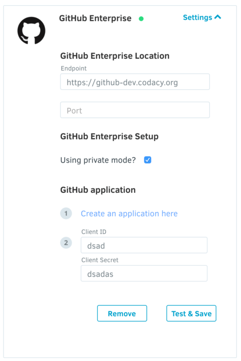

# Configuring GitHub Enterprise with Codacy Self-hosted

<table>
  <tbody>
    <tr>
      <td style="background-color: #ffc4ad;">
        

          Codacy Self-hosted running on Docker <strong>stopped being supported on February 16, 2021</strong>.
        

        

          <a href="/chart/" target="_self">Click here for updated documentation on how to install and configure Codacy Self-hosted on Kubernetes or MicroK8s.</a>
        

        

          If you are a current customer and have any questions regarding the migration process, please reach out to your CSM or <a href="mailto:success@codacy.com" target="_blank">success@codacy.com</a> for more information.
        

      </td>
    </tr>
  </tbody>
</table>

## Location

### Endpoint/Hostname **_\[required]_**

The endpoint or hostname where the GitHub Enterprise is deployed.

Should NOT contain:

-   Port (ex: 9000)

##### Correct:

-   `https://my.github.enterprise.example.com`

##### Incorrect:

-   `my.github.enterprise.example.com`
-   `https://my.github.enterprise.example.com/`
-   `https://my.github.enterprise.example.com:9000`
-   `https://user@pass:my.github.enterprise.example.com`
-   `my.github.enterprise.example.com:9000`
-   `my.github.enterprise.example.com:9000`

### Port

The port where the application is running.

This is not required.

The default port will be used if left empty.

## Configuration

### Protocol

Choose between HTTP and HTTPS protocol for communicating with your GitHub Enterprise installation. If you have problems connecting with the instance, this may be the cause.

### Private Mode

Whether your GitHub Enterprise is configured to use private mode or not.

## GitHub Application

### Application Creation **_\[required]_**

To integrate with GitHub we use a GitHub Application.

To create the application in your GitHub Enterprise, visit `settings/applications/new` and create an application pointing to your local Codacy deployment URL.

You can fill all the fields with the suggested text above or use your own text except for the field `Authorization callback URL` where you must insert your local Codacy deployment url.

The URL should contain the endpoint/ip, the protocol (HTTP or HTTPS), and, if applicable, the port where it is running.

##### Correct:

-   `http://your.codacy.url.com`
-   `http://your.codacy.url.com:9000`
-   `http://53.43.42.12`
-   `http://53.43.42.12:9000`

##### Incorrect:

-   `your.codacy.url.com`
-   `your.codacy.url.com:9000`
-   `53.43.42.12`
-   `53.43.42.12:9000`

### Token retrieval **_\[required]_**

After the application is created, you should copy both the `Client ID` and the `Client Secret` and paste them in the setup page on your Codacy Self-hosted.

After this is done you will be able to use GitHub Enterprise as an authentication method to add repositories and as an integration in the repository settings.
