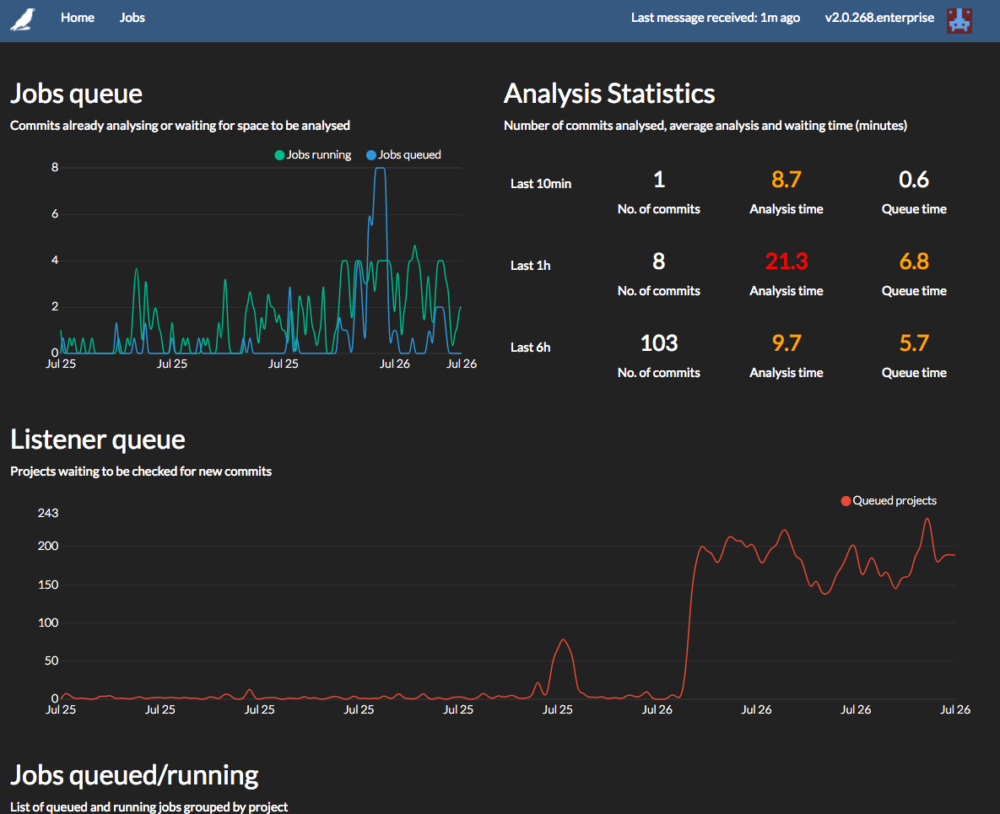
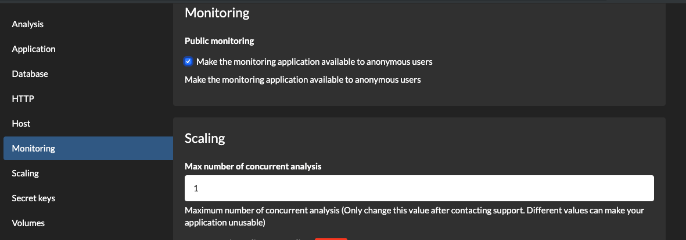

# Monitoring Codacy Self-hosted

<table>
  <tbody>
    <tr>
      <td style="background-color: #ffc4ad;">
        

          Codacy Self-hosted running on Docker is deprecated since April 2020 and will <strong>stop being supported on February 16, 2021</strong>. 
          Codacy will continue to provide critical bug fixes and tool updates for this version (but no more feature enhancements) until the end of support.
        

        

          <a href="/chart/" target="_self">Click here for updated documentation on how to install and configure Codacy Self-hosted on Kubernetes or MicroK8s.</a>
        

        

          If you are a current customer and have any questions regarding the migration process, please reach out to your CSM or <a href="mailto:success@codacy.com" target="_blank">success@codacy.com</a> for more information.
        

      </td>
    </tr>
  </tbody>
</table>

You can monitor your Codacy analysis here: This keeps track of the number of commits in the queue to be analyzed as well as repositories under analysis.  

Codacy analysis usually starts within seconds. A high number of repositories queued for analysis may cause delays; you can check this in the Monitoring.

## How do I access the Monitoring tool?  

If you are a Codacy Administrator, you can access Crow, your Monitoring tool, directly from Codacy.

Alternatively, you can go to port 16005. Your login details are the same as the ones used in the Codacy control panel.

If you want, you can also give access to other users in your organization by sharing the page URL, even if they are not Admins. You can do that by enabling the "Public monitoring" option in your control panel.  

